    <h1>Proyecto POO - Juego ARPG</h1>
    
Andres David Quijano Alvarez

    
Jherson Alejandro Buitrago Jimenez

---

# 1. Necesidad y objetivos del negocio

### *Necesidades*:
Crear una experiecia de juego que combine la precisión y estetica de los juegos plataforma junto con la progresion caracteristica de los ARPG (Action Role-Playing Game)

### *Objetivos Principales*:
- Desarrollar un producto minimo viable (PMV) para alcanzar jugadores interezados en juegos ARPG.
- Demostrar conceptos de POO (herencia, polimorfismo, encapsulamiento, abstracción)
- Crear una experiencia jugable con al menos 5-10 niveles funcionales
- Implementar un sistema de combate basico junto con un arbol de pasivas para leveo basico ARPG
  

# 2. Procesos actuales

### *Metodología de desarrollo*: 
- Agile/Scrum

### *Ciclo de Desarrollo*: 
- Planificación de sprints semanales/quincenales (dependiendo de la carga de trabajo)
- Diseño de personajes, assets, musica, SFX y estructuración basica del juego.
- Implementación de mecanicas basicas (combate, arbol de pasivas, leveo, efectos de estado)
- Pruebas y depuración continua
  

# 3. Usuarios y roles

### *Jugadores*:
- Compañeros
- Personas interesadas en juegos ARPG/Plataformas

### *Roles internos del proyecto*:
- Desarrollador principal: Andres Quijano
- Diseñador de niveles: Alejandro Jiménez
- Artista: Alejandro Jiménez
- **Testers**:
    - Andres Quijano
    - Alejandro Jiménez
    - Compañeros
  

# 4. Infraestructura Tecnológica
- Seguimiento de tareas: Notion
- Motor: Godot Engine (.NET Support)
- IDE: VSCode + Godot Tools (Extension)
- Lenguajes: C#
- Diseño Grafico: Libresprite, Affinity
- Musica y SFX: Ableton Live 12 Suite
- Hardware: Computadora con capacidad de desarrollo (GPU para shaders)
  

# 5. Gobernanza, políticas, presupuesto y programación

### *Estructura de decisión*:
- Decisiones mayores (estructura, mecanicas principales) por consenso
- Desiciones menores (detalles de implementación) por responsable del modulo
- Reuniones semanales de sincronización

### *Roles y responsabilidades*:
| Miembro | Responsabilidades principales |
|---------|------------------------------|
| **Andres Quijano** | • Motor del juego y física • Personaje principal (movimiento, saltos) • Cámara y controles • Optimización |
| **Alejandro Jimenez** | • Sistema de combate ARPG • Enemigos y IA básica • UI/UX (menús, HUD) • Assets y animaciones • Musica y SFX |

### *Responsabilidades compartidas*:
  - Diseño de niveles
  - Pruebas y depuración
  - Documentación del código
  - Preparación de la entrega final

## Políticas del Proyecto

- **Código y desarrollo:**
  - Seguir principios SOLID y buenas prácticas POO
  - Commits descriptivos en Git (formato: "[Módulo] Acción realizada")
  - Code reviews antes de mergear a rama principal
  - Comentarios obligatorios en clases y métodos complejos
  - Estilo de código consistente (definir estándar al inicio)

- **Comunicación:**
  - Canal de Discord/para comunicación diaria
  - Reporte de progreso cada 2-3 días (Notion)
  - Notificación inmediata si hay bloqueos técnicos

### *Presupuesto*:

- **Económico:** $0 (casi todo con herramientas y recursos gratuitos o ya pagados anteriormente)
- **Recursos humanos:** Tiempo individual estimado: 100/120 horas por persona (200-240 horas totales)

### *Programación y Cronograma*:

- Fase 1: Fundaciones (Semanas 1-3)
- Fase 2: Mecánicas Core (Semanas 4-6)
- Fase 3: Contenido (Semanas 7-10)
- Fase 5: Diseño de sonido y Musica (Semanas 11-13)
- Fase 4: Pulido y Entrega (Semana 14)

---
  

# Mapa de Impacto

---
  

# Diagramas de Procesos

### *Proceso de Juego (Experiencia del Usuario)*

  

### *Proceso de Combate (ciclo de Batalla)*

  

### *Proceso de Leveo (ARPG)*

---
  

# Requerimientos 
 
### *Requerimientos funcionales*:

#### Módulo de Personaje Principal

| ID | Requerimiento | Descripción | Prioridad |
|----|--------------|-------------|-----------|
| RF-01 | Movimiento básico | El personaje debe poder moverse horizontalmente (izquierda/derecha) con fluidez | Alta |
| RF-02 | Salto | El personaje debe poder saltar y realizar doble salto (característica ARPG) | Alta |
| RF-03 | Correr | El personaje debe poder correr (movimiento más rápido) | Media |
| RF-04 | Salud | El personaje debe tener una barra de vida que se reduzca al recibir daño | Alta |
| RF-05 | Muerte | Al llegar a 0 de vida, el personaje debe morir y mostrar pantalla de Game Over | Alta |
| RF-06 | Estadísticas | El personaje debe tener stats (fuerza, defensa, velocidad) que afecten gameplay | Media |
| RF-07 | Nivel | El personaje debe poder subir de nivel al ganar experiencia | Baja (si hay tiempo) |

#### Módulo de Combate

| ID | Requerimiento | Descripción | Prioridad |
|----|--------------|-------------|-----------|
| RF-08 | Ataque básico | El personaje debe poder realizar un ataque cuerpo a cuerpo (ej. espada) | Alta |
| RF-09 | Daño a enemigos | Los ataques deben reducir la vida de los enemigos | Alta |
| RF-10 | Habilidad especial | El personaje debe tener al menos una habilidad especial (ej. dash, proyectil) | Media |
| RF-11 | Enfriamiento | Las habilidades especiales deben tener tiempo de reutilización (cooldown) | Media |
| RF-12 | Mana/Energía | Las habilidades deben consumir un recurso (mana, stamina) | Baja |

#### Módulo de Enemigos

| ID | Requerimiento | Descripción | Prioridad |
|----|--------------|-------------|-----------|
| RF-13 | Enemigo básico | Debe existir al menos un tipo de enemigo con movimiento simple | Alta |
| RF-14 | Patrullaje | El enemigo debe moverse entre puntos definidos | Media |
| RF-15 | Detección | El enemigo debe detectar al jugador en un rango | Alta |
| RF-16 | Persecución | Al detectar al jugador, debe moverse hacia él | Alta |
| RF-17 | Ataque enemigo | El enemigo debe atacar al jugador al estar cerca | Alta |
| RF-18 | Drop de items | Al morir, los enemigos deben soltar experiencia/vida | Media |

#### Módulo de Niveles

| ID | Requerimiento | Descripción | Prioridad |
|----|--------------|-------------|-----------|
| RF-19 | Plataformas | El nivel debe contener plataformas para saltar | Alta |
| RF-20 | Obstáculos | Debe haber obstáculos (espinas, vacío) que dañen al jugador | Alta |
| RF-21 | Checkpoints | El jugador debe reaparecer en puntos específicos al morir | Media |
| RF-22 | Puertas/Salidas | Debe haber una forma de avanzar al siguiente nivel | Alta |
| RF-23 | Items recolectables | Debe haber items para recuperar vida/mana | Media |

#### Módulo de Interfaz (UI)

| ID | Requerimiento | Descripción | Prioridad |
|----|--------------|-------------|-----------|
| RF-24 | HUD básico | Mostrar barra de vida del jugador | Alta |
| RF-25 | Contador | Mostrar experiencia/puntuación actual | Media |
| RF-26 | Menú pausa | Poder pausar el juego con opción de continuar/salir | Alta |
| RF-27 | Pantalla inicio | Menú principal con opción "Comenzar juego" | Alta |
| RF-28 | Tutorial | Breve explicación de controles al inicio | Baja |
  

### *Requerimientos no funcionales*:

#### Rendimiento

| ID | Requerimiento | Descripción | Prioridad |
|----|--------------|-------------|-----------|
| RNF-01 | FPS estables | El juego debe mantener 60 FPS en hardware de gama media | Alta |
| RNF-02 | Tiempo de carga | Los niveles deben cargar en menos de 3 segundos | Media |
| RNF-03 | Optimización | El juego no debe consumir más de 500MB de RAM | Media |
| RNF-04 | Respuesta inputs | Los controles deben responder en menos de 0.1 segundos | Alta |

#### Usabilidad

| ID | Requerimiento | Descripción | Prioridad |
|----|--------------|-------------|-----------|
| RNF-05 | Controles intuitivos | Los controles deben ser fáciles de aprender (ej. flechas/ WASD) | Alta |
| RNF-06 | Feedback visual | El jugador debe ver claramente cuando recibe/hace daño | Alta |
| RNF-07 | Consistencia | Elementos similares deben comportarse igual en todo el juego | Alta |
| RNF-08 | Accesibilidad | Opción de reasignar teclas (si hay tiempo) | Baja |

#### Confiabilidad

| ID | Requerimiento | Descripción | Prioridad |
|----|--------------|-------------|-----------|
| RNF-09 | Sin crashes | El juego no debe cerrarse inesperadamente | Alta |
| RNF-10 | Guardado | El progreso debe persistir entre sesiones (si hay tiempo) | Media |
| RNF-11 | Manejo de errores | Si algo falla, debe mostrar mensaje amigable | Media |

#### Código y Mantenibilidad

| ID | Requerimiento | Descripción | Prioridad |
|----|--------------|-------------|-----------|
| RNF-12 | Modularidad | El código debe estar organizado por módulos (Personaje, Enemigos, Niveles) | Alta |
| RNF-13 | Documentación | Las clases y métodos complejos deben tener comentarios | Alta |
| RNF-14 | Convenciones POO | Debe demostrar herencia, polimorfismo, encapsulamiento | Alta |
| RNF-15 | Estilo consistente | Todo el código debe seguir el mismo formato | Media |

#### Portabilidad

| ID | Requerimiento | Descripción | Prioridad |
|----|--------------|-------------|-----------|
| RNF-16 | Multiplataforma | El juego debe funcionar en Windows y al menos otro SO (Linux/Mac) | Media |
| RNF-17 | Resoluciones | Debe adaptarse a diferentes tamaños de pantalla | Media |
| RNF-18 | Requisitos del Sistema | Mantener el juego el juego dentro de los requisitos Medios actuales (8GB RAM, Procesador i5 12000-Gen/Ryzen 5 5000-Gen, GPU RTX 2000 Series/RX 6000 Series, 20GB SSD) | Alta |

---
  

# Referencias

### *Path of Exile*

  

### *Diablo IV*

  

### *Children of Morta*

  

### *Arbol de Pasivas*

