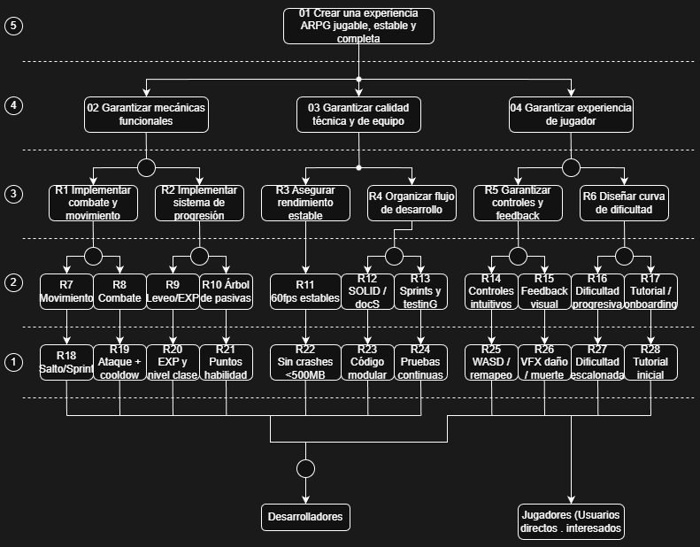

    <h1>Proyecto POO - Juego ARPG</h1>
    
Andres David Quijano Alvarez

    
Jherson Alejandro Buitrago Jimenez

---

### *Diagrama Causa Efecto*

  

### *Diagrama de Objetivos*

### Tabla 1 — Causas × Procesos

| Causa | P1 Gameplay | P2 Combate | P3 Leveo | P4 Fail/Spawn | P5 Menú/Pausa | P6 Carga nivel | P7 Enemigo final | Valor | % |
|---|---|---|---|---|---|---|---|---|---|
| **SP1 — Diseño del juego** | | | | | | | | | |
| C1 Mecánicas ARPG mal balanceadas | O1+O2+R1 (5+4+3)=**12** | O1+O2+O4+R1 (5+4+4+3)=**16** | O1+O2+R2 (5+4+3)=**12** | O1 (5)=**5** | — | — | O1+O2+O4+R1 (5+4+4+3)=**16** | 61 | 7.6% |
| C2 Sistema de progresión incompleto | O1 (5)=**5** | — | O1+O2+R2+R9 (5+4+3+3)=**15** | O1+O2 (5+4)=**9** | — | — | O1+O2 (5+4)=**9** | 38 | 4.7% |
| C3 Niveles poco desafiantes | O1+O2+O4+R1 (5+4+4+3)=**16** | O1+O2+R1 (5+4+3)=**12** | — | O1 (5)=**5** | — | O1+O2 (5+4)=**9** | O1+O2+R1 (5+4+3)=**12** | 54 | 6.7% |
| C4 Desbalance plataformas y combate | O1+O2+R1 (5+4+3)=**12** | O1+O2+O4+R1 (5+4+4+3)=**16** | — | O1 (5)=**5** | — | — | O1+O2 (5+4)=**9** | 42 | 5.2% |
| **SP2 — Tecnología y software** | | | | | | | | | |
| C5 Bugs en físicas o colisiones | O1+O2+O3+R3 (5+4+4+3)=**16** | O1+O2+R1 (5+4+3)=**12** | — | O1+O2+O3+R3 (5+4+4+3)=**16** | — | O1+O3+R3 (5+4+3)=**12** | O1+O2 (5+4)=**9** | 65 | 8.1% |
| C6 Problemas de rendimiento | O1+O3+R3 (5+4+3)=**12** | O1+O3 (5+4)=**9** | O1 (5)=**5** | O1+O3 (5+4)=**9** | O1+O3+R3 (5+4+3)=**12** | O1+O2+O3+R3 (5+4+4+3)=**16** | O1+O3+R3 (5+4+3)=**12** | 75 | 9.3% |
| C7 Arquitectura de código poco modular | O1+O3 (5+4)=**9** | O1+O3 (5+4)=**9** | O1+O3+R4 (5+4+3)=**12** | O1 (5)=**5** | O1+O3+R4 (5+4+3)=**12** | O1+O3 (5+4)=**9** | O1 (5)=**5** | 61 | 7.6% |
| C8 IA de enemigos defectuosa | O1+O2 (5+4)=**9** | O1+O2+O4+R1 (5+4+4+3)=**16** | — | O1+O2 (5+4)=**9** | — | — | O1+O2+O4+R1 (5+4+4+3)=**16** | 50 | 6.2% |
| C9 Errores en estados del jugador | O1+O2+R1 (5+4+3)=**12** | O1+O2+O4+R1 (5+4+4+3)=**16** | O1+O2+R2 (5+4+3)=**12** | O1+O2+O3+R3 (5+4+4+3)=**16** | — | — | O1+O2+O4+R1 (5+4+4+3)=**16** | 72 | 8.9% |
| **SP3 — Contenido y arte** | | | | | | | | | |
| C10 Falta de assets | O1+O2+R1 (5+4+3)=**12** | O1+O2 (5+4)=**9** | O1 (5)=**5** | O1 (5)=**5** | O1 (5)=**5** | O1+O2 (5+4)=**9** | O1+O2 (5+4)=**9** | 54 | 6.7% |
| C11 Animaciones incompletas | O1+O2 (5+4)=**9** | O1+O2+R1 (5+4+3)=**12** | — | O1+O2 (5+4)=**9** | — | — | O1+O2+R1 (5+4+3)=**12** | 42 | 5.2% |
| C12 Efectos visuales insuficientes | O1+O4+R5 (5+4+3)=**12** | O1+O2+R1 (5+4+3)=**12** | — | O1+O4+R5 (5+4+3)=**12** | — | — | O1+O2+R1 (5+4+3)=**12** | 48 | 5.9% |
| C13 Poca variedad de enemigos | O1+O2 (5+4)=**9** | O1+O2+O4+R1 (5+4+4+3)=**16** | — | O1 (5)=**5** | — | — | O1+O2+O4+R1 (5+4+4+3)=**16** | 46 | 5.7% |
| **SP4 — Proceso de desarrollo** | | | | | | | | | |
| C14 Mala planificación de sprints | O1+O3 (5+4)=**9** | O1+O3 (5+4)=**9** | O1+O3+R4 (5+4+3)=**12** | O1 (5)=**5** | O1+O3 (5+4)=**9** | O1+O3+R4 (5+4+3)=**12** | O1+O3 (5+4)=**9** | 65 | 8.1% |
| C15 Integración tardía de sistemas | O1+O3+R4 (5+4+3)=**12** | O1+O3+R4 (5+4+3)=**12** | O1+O3+R4 (5+4+3)=**12** | O1 (5)=**5** | O1 (5)=**5** | O1+O2+O3+R4 (5+4+4+3)=**16** | O1+O3 (5+4)=**9** | 71 | 8.8% |
| C16 Falta de pruebas continuas | O1+O3+R4 (5+4+3)=**12** | O1+O2+O3+R4 (5+4+4+3)=**16** | O1+O3+R4 (5+4+3)=**12** | O1+O3+R4 (5+4+3)=**12** | O1 (5)=**5** | O1+O3 (5+4)=**9** | O1+O2+O3+R4 (5+4+4+3)=**16** | 82 | 10.2% |
| C17 Dependencias entre módulos | O1+O3 (5+4)=**9** | O1+O3 (5+4)=**9** | O1+O3+R4 (5+4+3)=**12** | O1 (5)=**5** | O1+O3+R4 (5+4+3)=**12** | O1+O3+R4 (5+4+3)=**12** | O1 (5)=**5** | 64 | 7.9% |
| **SP5 — Equipo** | | | | | | | | | |
| C18 Sobrecarga de tareas | O1+O3 (5+4)=**9** | O1+O3 (5+4)=**9** | O1+O3+R4 (5+4+3)=**12** | O1 (5)=**5** | O1+O3 (5+4)=**9** | O1+O3 (5+4)=**9** | O1+O3 (5+4)=**9** | 62 | 7.7% |
| C19 Falta de experiencia en sistemas | O1+O3+R3 (5+4+3)=**12** | O1+O2+O3+R3 (5+4+4+3)=**16** | O1+O3 (5+4)=**9** | O1 (5)=**5** | O1 (5)=**5** | O1+O3+R3 (5+4+3)=**12** | O1+O3+R3 (5+4+3)=**12** | 71 | 8.8% |
| C20 Problemas de comunicación | O1+O3 (5+4)=**9** | O1+O3 (5+4)=**9** | O1 (5)=**5** | O1 (5)=**5** | O1+O3+R4 (5+4+3)=**12** | O1 (5)=**5** | O1 (5)=**5** | 50 | 6.2% |
| **SP6 — Experiencia del jugador** | | | | | | | | | |
| C21 Controles poco intuitivos | O1+O2+O4+R5 (5+4+4+3)=**16** | O1+O4+R5 (5+4+3)=**12** | — | O1+O4 (5+4)=**9** | O1+O4+R5 (5+4+3)=**12** | — | O1+O4+R5 (5+4+3)=**12** | 61 | 7.6% |
| C22 Falta de feedback visual | O1+O4+R5 (5+4+3)=**12** | O1+O2+O4+R5 (5+4+4+3)=**16** | — | O1+O4+R5 (5+4+3)=**12** | — | — | O1+O2+O4 (5+4+4)=**13** | 53 | 6.6% |
| C23 Curva de dificultad mal diseñada | O1+O4+R6 (5+4+3)=**12** | O1+O2+O4+R6 (5+4+4+3)=**16** | O1+O4+R6 (5+4+3)=**12** | O1+O4+R6 (5+4+3)=**12** | — | O1 (5)=**5** | O1+O2+O4+R6 (5+4+4+3)=**16** | 73 | 9.0% |
| C24 Falta de tutorial | O1+O4+R5 (5+4+3)=**12** | — | — | O1+O4 (5+4)=**9** | O1+O2+O4+R5 (5+4+4+3)=**16** | O1+O4 (5+4)=**9** | — | 46 | 5.7% |
| **Total** | | | | | | | | **806** | **100%** |

---

### Tabla 2 — Agrupada por subproblema

| Causa | Valor | % global | Subproblema | % Global SP | % sobre SP |
|---|---|---|---|---|---|
| C1 | 61 | 7.6% | **SP1** Diseño del juego | **23.9%** | 31.6% |
| C2 | 38 | 4.7% | | | 19.7% |
| C3 | 54 | 6.7% | | | 28.0% |
| C4 | 42 | 5.2% | | | 21.8% |
| C5 | 65 | 8.1% | **SP2** Tecnología y software | **39.8%** | 20.3% |
| C6 | 75 | 9.3% | | | 23.4% |
| C7 | 61 | 7.6% | | | 19.1% |
| C8 | 50 | 6.2% | | | 15.6% |
| C9 | 72 | 8.9% | | | 22.5% |
| C10 | 54 | 6.7% | **SP3** Contenido y arte | **23.5%** | 28.4% |
| C11 | 42 | 5.2% | | | 22.1% |
| C12 | 48 | 5.9% | | | 25.3% |
| C13 | 46 | 5.7% | | | 24.2% |
| C14 | 65 | 8.1% | **SP4** Proceso de desarrollo | **34.9%** | 23.1% |
| C15 | 71 | 8.8% | | | 25.3% |
| C16 | 82 | 10.2% | | | 29.2% |
| C17 | 64 | 7.9% | | | 22.8% |
| C18 | 62 | 7.7% | **SP5** Equipo | **22.6%** | 33.9% |
| C19 | 71 | 8.8% | | | 38.8% |
| C20 | 50 | 6.2% | | | 27.3% |
| C21 | 61 | 7.6% | **SP6** Experiencia del jugador | **29.4%** | 25.8% |
| C22 | 53 | 6.6% | | | 22.5% |
| C23 | 73 | 9.0% | | | 30.9% |
| C24 | 46 | 5.7% | | | 19.5% |
| **Total** | **806** | **100%** | | | |

---

### *Diagrama causa efecto con porcentajes (Sobre SP)*

### *Diagrama causa efecto con porcentajes (global)*
